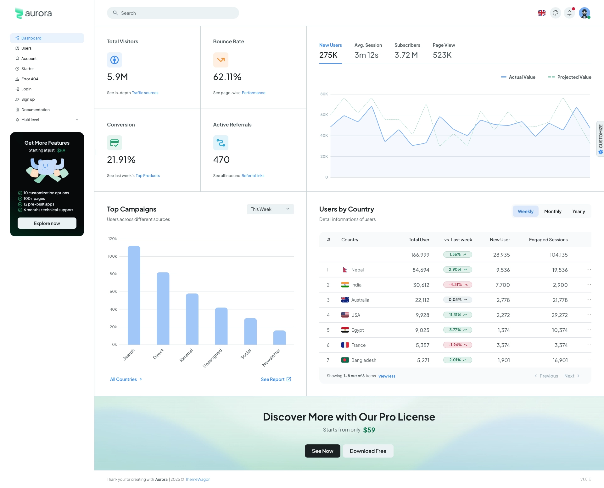

# Aurora Free React Material UI Admin Template

Aurora is a free Material UI dashboard template crafted with React and Vite.
It focuses on delivering a clean, modern, and intuitive user experience with well-structured pages and flexible components.
Aurora comes fully responsive out of the box, ensuring a seamless experience on any device — from large desktop screens to mobile layouts.

✨ Support us! If you enjoy using Aurora, don’t forget to click the ⭐ at the top of the repo!

## Pages

- [Dashboard](https://themewagon.github.io/aurora-free/)
- [Users](https://themewagon.github.io/aurora-free/users)
- [Account](https://themewagon.github.io/aurora-free/account)
- [Starter](https://themewagon.github.io/aurora-free/starter)
- [Error 404](https://themewagon.github.io/aurora-free/404)
- [Login](https://themewagon.github.io/aurora-free/auth/login)
- [Sign up](https://themewagon.github.io/aurora-free/auth/sign-up)

## Quick start

- Clone the repo: `git clone https://github.com/themewagon/aurora-free.git`
- Recommended: `Node.js v20.x`
- **Install:** `npm i` or `pnpm i`
- **Start:** `npm run dev` or `pnpm dev`
- **Build:** `npm run build` or `pnpm build`
- Open browser: `http://localhost:5005`

## Upgrade to PRO Version

| Aurora Free                  | [Aurora Pro](https://mui.com/store/items/aurora/)                                                                                                                                       |
| :--------------------------- | :-------------------------------------------------------------------------------------------------------------------------------------------------------------------------------------- |
| **7** Pages.                 | **100+** Pages.                                                                                                                                                                         |
| **Partial** theme customize. | **Fully** theme customize.                                                                                                                                                              |
| -                            | **Next.js** version.                                                                                                                                                                    |
| -                            | **TypeScript** version (Standard Plus and Extended license).                                                                                                                            |
| -                            | Design **Figma** file (Standard Plus and Extended license).                                                                                                                             |
| -                            | Authentication with **JWT**, **Auth0**, and **Firebase**.                                                                                                                               |
| -                            | Light/dark mode, custom theme preset, multiple layouts to choose from, right-to-left, form validation... [+more components](https://aurora.themewagon.com/component-docs/autocomplete). |
| -                            | 1 year of free updates / 6 months of technical support.                                                                                                                                 |

## License

Distributed under the [MIT](https://github.com/themewagon/aurora-free/blob/main/LICENSE.md) license.

## Support

Email: support@themewagon.com
